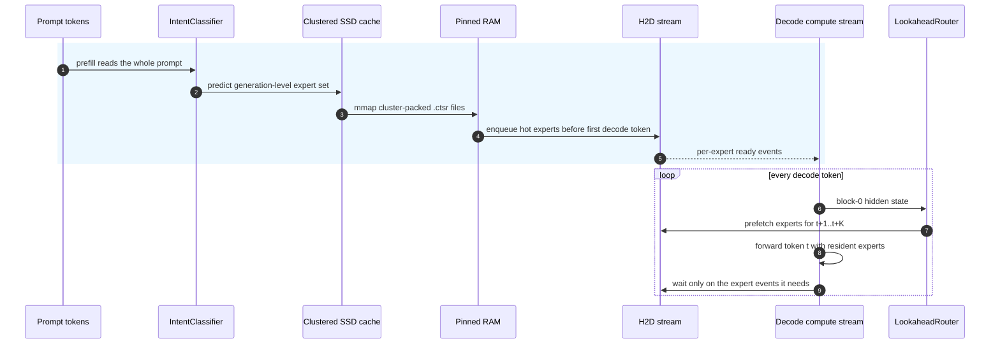
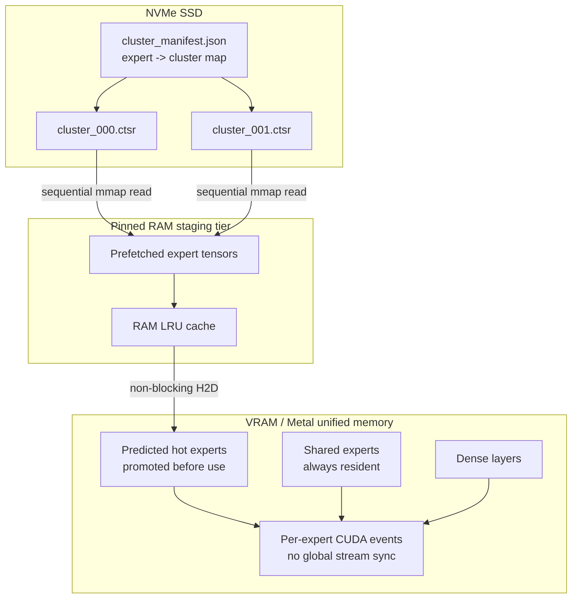
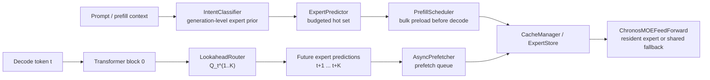
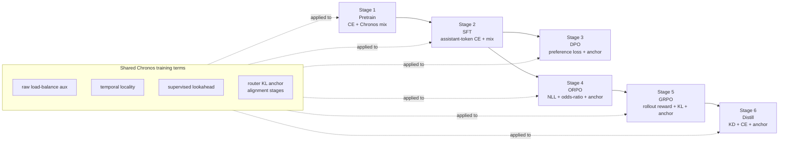
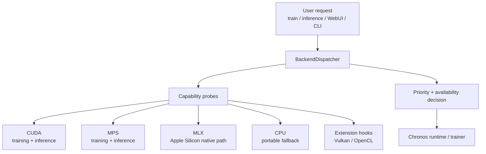
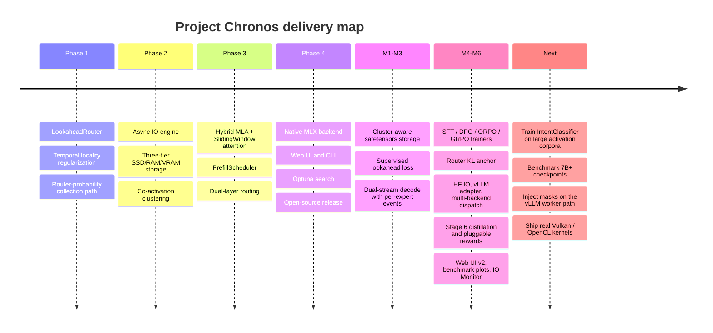
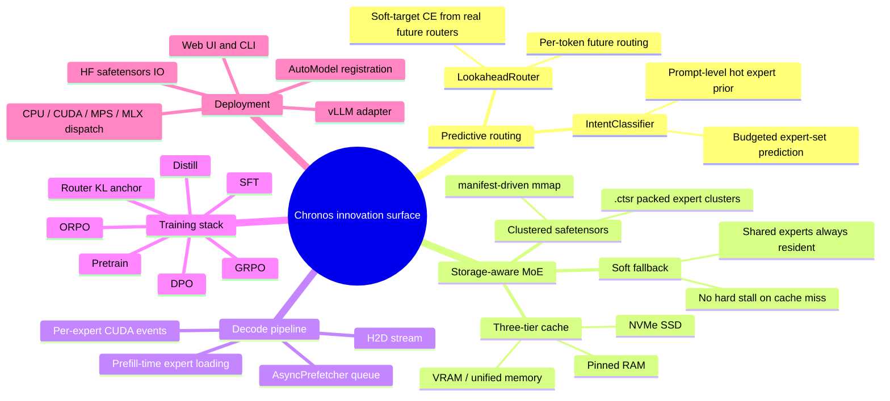

# Project Chronos (Experimental)

**A storage-aware MoE stack built for SSD+DRAM hybrid inference, with a full six-stage training pipeline.**

[](https://pypi.org/project/project-chronos/)
[](LICENSE)
[](https://python.org)

[中文文档](README_zh.md)

---

## Why reactive MoE offload breaks down

Mainstream MoE models such as Mixtral, DeepSeek-MoE, and Qwen-MoE make routing decisions **at decode time, token by token**. The model discovers which experts it needs only when the next token is already on the critical path. If those experts are not resident in VRAM, generation stalls while weights are moved from SSD to RAM to VRAM.

That is not a tuning issue. It is an architectural mismatch.

Most offload runtimes assume the model was originally designed for full VRAM residency, then try to patch storage pressure afterward. On consumer hardware, that usually means the decode loop ends up paying the IO bill over and over again.

---

## Chronos in one line

**Move IO into prefill. Move synchronization down to the expert-event level.**



Two things matter here:

1. **Prefill-time loading**: `PrefillScheduler` and `IntentClassifier` bulk-load predicted experts before the first decode token.
2. **Per-expert event sync (M3)**: `promote_to_vram(blocking=False)` records a `torch.cuda.Event` on the `_h2d_stream`, and the compute stream waits only on the experts it actually needs. No more `stream.synchronize()` for the whole system.

Under a simulated 30 ms SSD delay, the new path keeps **35 ms+ per token** of pipeline slack compared with the older blocking path.

---

## Three-tier storage (M1: cluster-aware safetensors)



`cluster_manifest.json` and `.ctsr` files are produced offline by Louvain clustering. At runtime, Chronos uses `safetensors.safe_open(...).mmap` to bring an entire expert cluster into RAM in one shot, turning random reads into mostly sequential reads.

### Cache misses degrade gracefully instead of stalling

Even the worst case does not hard-stop generation:

```python
# Pure tensor math: no Python branch, no graph break under torch.compile
output = avail[i] * expert_output + (1.0 - avail[i]) * shared_expert_output
```

The shared expert is always resident, so generation continues while the missing expert finishes loading in the background. Quality degrades smoothly and recovers automatically once the expert becomes available.

---

## Dual-layer routing with supervised lookahead (M2)



| | IntentClassifier (Layer 1) | LookaheadRouter (Layer 2) |
|---|---|---|
| **When it runs** | Once during prefill | Every token during decode |
| **Input** | Full prompt (up to 512 tokens) | Hidden state after Block 0 |
| **Output** | Expert set for the full generation | Expert IDs for t+1, t+2 |
| **Training target** | Supervised from real activation logs | **`L_lookahead` supervised by real router decisions at t+k** |
| **Parameter count** | ~10-15M | ~2M |

Before M2, the lookahead head was just a head with no real supervision. M2 adds a proper soft-target objective:

$$
\mathcal{L}_{\mathrm{lookahead}}
= \frac{1}{|\mathcal{K}_{\mathrm{valid}}|}
\sum_{k \in \mathcal{K}_{\mathrm{valid}}}
\mathbb{E}_{b,t}
\left[
  - \sum_{e=1}^{E}
  \mathrm{sg}\!\left(P_{b,t+k,e}\right)
  \log Q_{b,t,e}^{(k)}
\right].
$$

That turns the lookahead router into an actual predictor of future routing, instead of a best-effort heuristic.

---

## Full training stack: Stage 1 -> Stage 6

Each stage has its own entry script, and every one of them inherits the shared Chronos loss mixer: balance loss, temporal locality loss, lookahead loss, and, for alignment stages, a router KL anchor that keeps RL/DPO updates from destroying cache locality.



| Stage | Script | Core objective | Router KL anchor (default lambda) |
|---|---|---|---|
| 1 Pretrain | `train_chronos.py` | CE + balance + temporal + lookahead | 0.0 (off) |
| 2 SFT | `train_chronos_sft.py` | SFT loss + shared Chronos mix | 0.01 (weak) |
| 3 DPO | `train_chronos_dpo.py` | DPO `log-sigma(beta * logits)` + mix | 0.10 (strong) |
| 4 ORPO | `train_chronos_orpo.py` | NLL + lambda * ORPO term | 0.10 |
| 5 GRPO | `train_chronos_grpo.py` | `PG * A - beta * KL` with `ToyReward` or pluggable `LMRewardModel` | 0.10 |
| 6 Distill | `train_chronos_distill.py` | `alpha * T^2 * KL(student || teacher) + (1 - alpha) * CE` | 0.05 |

The full six-stage comparison harness lives in `tools/compare_minimind_chronos_v3.py`.

---

## Backend dispatch (M5)



```python
from chronos.backend import BackendDispatcher

d = BackendDispatcher()
d.available()   # ['mlx', 'mps', 'cpu'] on Apple Silicon
                # ['cuda', 'cpu']        on NVIDIA hosts
d.select()      # choose the best available backend automatically
d.describe()    # human-readable capability summary
```

- **First-class backends for training and inference**: `cpu`, `mps`, `cuda`, `mlx`
- **Inference-only / experimental**: `vulkan` when PyTorch was custom-built with `USE_VULKAN=ON`
- **Third-party extension hook**: `opencl`, via `chronos/backend/ext/opencl.py:PROBE()`

Honest note: upstream PyTorch does not ship a real OpenCL backend, and Vulkan support is still niche. Chronos provides a dispatcher seam so external integrations can plug in cleanly without touching core code.

---

## Hugging Face and vLLM compatibility (M5)

- `ChronosForCausalLM` subclasses `PreTrainedModel` and registers `AutoConfig` and `AutoModelForCausalLM`, so loading does **not** require `trust_remote_code`:

  ```python
  from transformers import AutoModelForCausalLM

  model = AutoModelForCausalLM.from_pretrained("./out_dir")
  ```

- `chronos.model.hf_io.save_chronos_pretrained` and `load_chronos_pretrained` emit standard `model.safetensors` + `config.json`, while also carrying `cluster_manifest.json` and `.ctsr` files for expert-cache layout. Roundtrip logit drift is `0.00e+00`.

- `chronos.serving.register_chronos_with_vllm()` registers Chronos with the vLLM `ModelRegistry` when vLLM is installed. If vLLM is absent, it prints an install hint and exits cleanly. Worker-side mask injection is documented in [docs/vllm_integration.md](docs/vllm_integration.md).

---

## Compared with existing offload stacks

| Feature | llama.cpp offload | vLLM offload | **Project Chronos** |
|---|---|---|---|
| Expert prediction | None | None | **Predictive (`IntentCLF` + `LookaheadRouter`)** |
| Lookahead training | n/a | n/a | **Supervised `L_lookahead` (M2)** |
| IO timing | During decode, blocking | During decode, blocking | **During prefill, async** |
| Decode pipeline | Synchronous | Synchronous | **Dual-stream + per-expert events (M3)** |
| Cache miss behavior | Hard stall | Hard stall | **Soft gating, zero hard stall** |
| Disk format | GGUF | safetensors | **Cluster-packed safetensors (`.ctsr`)** |
| Training integration | Post-hoc patch | Post-hoc patch | **Native six-stage stack + router KL anchor** |
| Backend dispatch | Compile-time fixed | CUDA only | **`cpu` / `mps` / `cuda` / `mlx` + extension hooks** |
| Apple Silicon support | Partial | No | **Full MLX backend** |
| Hugging Face compatibility | GGUF only | Yes | **Yes, with expert-cache metadata** |
| vLLM compatibility | n/a | Native | **Optional adapter** |

---

## Objective

$$
\mathcal{L}_{\mathrm{total}}
= \mathcal{L}_{\mathrm{base}}
+ \lambda_{\mathrm{bal}} \mathcal{L}_{\mathrm{aux}}
+ \lambda_{\mathrm{tmp}} \mathcal{L}_{\mathrm{temporal}}
+ \lambda_{\mathrm{LA}} \mathcal{L}_{\mathrm{lookahead}}
+ \lambda_{\mathrm{anc}} \mathcal{L}_{\mathrm{routerKL}}
$$

$$
\mathcal{L}_{\mathrm{aux}}
= E \sum_{e=1}^{E} \mathit{load}_e \cdot \overline{p}_e
$$

$$
\mathcal{L}_{\mathrm{temporal}}
= \mathbb{E}_{b,t}
\left[
  \left\| P_{b,t,:} - P_{b,t-1,:} \right\|_2^2
\right]
$$

$$
\mathcal{L}_{\mathrm{routerKL}}
= D_{\mathrm{KL}}
\left(
  \pi_{\theta}^{\mathrm{router}}
  \| 
  \pi_{\mathrm{ref}}^{\mathrm{router}}
\right)
$$

- $\mathcal{L}_{\mathrm{base}}$: stage-specific objective (`CE`, `DPO`, `ORPO`, `GRPO`, or distillation).
- $\mathcal{L}_{\mathrm{aux}}$: the unscaled MoE load-balance auxiliary term; Chronos applies $\lambda_{\mathrm{bal}}$ once in `chronos_loss_term`.
- $\mathcal{L}_{\mathrm{temporal}}$: encourages adjacent tokens to reuse similar expert distributions.
- $\mathcal{L}_{\mathrm{lookahead}}$: soft-target cross entropy from the real future router distribution to the lookahead prediction. Here $\mathrm{sg}(\cdot)$ means stop-gradient.
- $\mathcal{L}_{\mathrm{routerKL}}$: keeps alignment-stage updates from destroying the routing layout captured at stage start.

All lambda terms are searchable with Optuna TPE, together with structural hyperparameters such as `hidden_size`, `num_experts`, and `kv_latent_dim`.

---

## Installation

```bash
pip install project-chronos
```

Or from source:

```bash
git clone https://github.com/FonaTech/Project_Chronos
cd Project_Chronos
pip install -e ".[dev]"
```

**MLX (Apple Silicon):**

```bash
pip install "project-chronos[mlx]"
```

**vLLM serving (optional, Linux + CUDA only):**

```bash
pip install vllm
```

> **minimind dependency**: Project Chronos uses [minimind](https://github.com/jingyaogong/minimind) as its MoE kernel.
> If it is not found locally, Chronos clones it automatically into `~/.cache/chronos/minimind-master/` on first import.
> minimind is licensed under **Apache-2.0**. See [THIRD_PARTY_NOTICES.md](THIRD_PARTY_NOTICES.md) for attribution details.

**Requirements**: Python 3.10+, PyTorch 2.4+

---

## Quick start

### Web UI (M6: 7 tabs, 4 languages)

```bash
chronos-ui
# or
python chronos_app.py
```

Tabs included:

- `Config` with a live parameter / memory estimator merged in from the old Designer
- `Train` with its own `data_path`
- `6-Stage Pipeline` with per-stage dataset paths
- `Inference`
- `Benchmark` with Markdown table + bar plot
- `Auto-Tune` with persistent logs and one-click `Apply Best -> Config`
- `IO Monitor`

Built-in i18n: `zh-Hans`, `zh-Hant`, `en`, `ja`

### Stage 1: pretrain

```bash
python train_chronos.py \
    --data_path ./tests/fixtures/tiny_pretrain.jsonl \
    --hidden_size 256 --num_hidden_layers 4 --num_experts 4 \
    --epochs 1 --device cpu --save_dir ./out
```

### Stage 2-5: alignment chain

```bash
python train_chronos_sft.py  --data_path ./tests/fixtures/tiny_sft.jsonl  --from_weight chronos --save_dir ./out --device cpu
python train_chronos_dpo.py  --data_path ./tests/fixtures/tiny_dpo.jsonl  --from_weight sft     --save_dir ./out --device cpu
python train_chronos_orpo.py --data_path ./tests/fixtures/tiny_dpo.jsonl  --from_weight sft     --save_dir ./out --device cpu
python train_chronos_grpo.py --data_path ./tests/fixtures/tiny_grpo.jsonl --from_weight orpo    --save_dir ./out --device cpu \
    --reward toy   # or lm:/path/to/reward-model
```

### Stage 6: distillation

```bash
python train_chronos_distill.py \
    --data_path ./tests/fixtures/tiny_sft.jsonl \
    --teacher_path ./out/sft_192_moe.pth \
    --from_weight grpo --save_dir ./out --device cpu \
    --alpha 0.7 --temperature 4.0
```

### End-to-end comparison (minimind vs Chronos)

```bash
python tools/compare_minimind_chronos_v3.py \
    --pretrain_steps 150 --align_steps 30 --distill_steps 30 \
    --simulated_ssd_ms 30 --device cpu \
    --output results/compare_results_v3.json
```

This emits per-stage loss, HF roundtrip logit delta, tokens/sec, active-expert ratio, resident-expert bytes, M3 pipeline slack, and the backend inventory on the current host.

### Cluster-pack expert storage for sequential SSD reads

```python
from chronos.io.cluster_layout import (
    collect_activation_log,
    build_cooccurrence_matrix,
    try_louvain_clustering,
    repack_expert_weights_safetensors,
)

log = collect_activation_log(model, calib_loader, "cpu", max_batches=50)
clusters = try_louvain_clustering(build_cooccurrence_matrix(log, num_experts))
repack_expert_weights_safetensors(model, clusters, "./expert_cache_clustered")
```

### Search lambdas and structure hyperparameters automatically

```python
from chronos.tuning.chronos_auto_tuner import ChronosAutoTuner, ChronosSearchSpaceConfig

tuner = ChronosAutoTuner()
tuner.start(
    model_id="./out/chronos_256_moe.pth",
    dataset_path="./dataset/train.jsonl",
    search_space=ChronosSearchSpaceConfig(
        tune_lambda_balance=True,
        tune_lambda_temporal=True,
        tune_lambda_lookahead=True,
        tune_lookahead_steps=True,
        tune_hidden_size=True,
        tune_num_experts=True,
        tune_num_shared_experts=True,
        tune_kv_latent_dim=True,
    ),
    n_trials=20,
)
```

---

## Project layout

```text
Project_Chronos/
├── chronos/
│   ├── deps.py                    # Auto-download minimind if missing
│   ├── __init__.py                # AutoConfig / AutoModelForCausalLM registration
│   ├── model/
│   │   ├── config.py              # ChronosConfig
│   │   ├── hybrid_attention.py    # MLAAttention + SlidingWindowAttention
│   │   ├── lookahead_router.py    # Per-token lookahead predictor
│   │   ├── moe_chronos.py         # ChronosMOEFeedForward + shared experts + soft gating
│   │   ├── model_chronos.py       # ChronosForCausalLM
│   │   ├── temporal_loss.py       # Temporal locality + lookahead losses
│   │   └── hf_io.py               # save/load_chronos_pretrained + HF registration
│   ├── io/
│   │   ├── expert_store.py        # Three-tier storage + per-expert events
│   │   ├── async_prefetcher.py    # Async prefetch engine
│   │   ├── storage.py             # ClusterStorage: .ctsr safetensors + manifest
│   │   ├── cluster_layout.py      # Co-occurrence clustering + repacking
│   │   └── io_simulator.py        # CHRONOS_SIM_SSD_MS test hook
│   ├── router/
│   │   ├── intent_classifier.py   # Prompt-level expert predictor
│   │   ├── expert_predictor.py    # IntentVector -> ExpertSet
│   │   └── prefill_scheduler.py   # Prefill-time expert preloader
│   ├── mlx/
│   │   ├── attention.py / moe.py / model.py / expert_store.py / inference.py
│   ├── runtime/
│   │   ├── cache_manager.py       # prefetch_for_next_step / ensure_resident
│   │   ├── inference_engine.py    # End-to-end inference engine
│   │   └── metrics.py             # MetricsBus for the IO Monitor
│   ├── trainer/
│   │   ├── loss_mixin.py          # chronos_loss_term + router_kl_anchor
│   │   ├── chronos_trainer.py     # Pretrain
│   │   ├── sft_trainer.py         # Stage 2
│   │   ├── dpo_trainer.py         # Stage 3
│   │   ├── orpo_trainer.py        # Stage 4
│   │   ├── grpo_trainer.py        # Stage 5
│   │   ├── distill_trainer.py     # Stage 6
│   │   └── reward.py              # ToyReward / LMRewardModel / build_reward_fn
│   ├── tuning/
│   │   └── chronos_auto_tuner.py  # Optuna lambda + architecture search
│   ├── eval/
│   │   ├── io_profiler.py         # Lookahead validation
│   │   └── benchmark.py           # End-to-end benchmarking
│   ├── data/
│   │   └── flexible_dataset.py    # Flexible JSONL dataset loader
│   ├── backend/
│   │   ├── __init__.py            # BackendDispatcher (cpu/mps/cuda/mlx)
│   │   ├── dispatcher.py          # Capability probing + priority logic
│   │   └── ext/opencl.py          # Third-party OpenCL extension hook
│   ├── _backend_legacy.py         # Backward-compatible older APIs
│   ├── serving/
│   │   ├── __init__.py
│   │   └── vllm_adapter.py        # Optional vLLM registration
│   └── cli.py                     # Unified CLI
├── ui/                            # Gradio Web UI (zh-Hans / zh-Hant / en / ja)
│   ├── i18n.py
│   ├── estimator.py               # Live parameter / memory estimator
│   └── tabs/
│       ├── config_tab.py          # Config + Designer merged together
│       ├── train_tab.py           # Owns data_path
│       ├── pipeline_tab.py        # Per-stage datasets across all 6 stages
│       ├── inference_tab.py
│       ├── benchmark_tab.py       # Markdown table + gr.BarPlot
│       ├── autotune_tab.py        # Persistent logs + Apply Best -> Config
│       └── iomon_tab.py           # MetricsBus dashboard
├── chronos_app.py                 # Web UI entry
├── train_chronos.py               # Stage 1 entry
├── train_chronos_sft.py           # Stage 2 entry
├── train_chronos_dpo.py           # Stage 3 entry
├── train_chronos_orpo.py          # Stage 4 entry
├── train_chronos_grpo.py          # Stage 5 entry
├── train_chronos_distill.py       # Stage 6 entry
├── tools/
│   ├── compare_minimind_chronos.py
│   ├── compare_minimind_chronos_v2.py
│   └── compare_minimind_chronos_v3.py
├── tests/
│   ├── test_smoke.py
│   ├── test_smoke_cuda.py
│   └── fixtures/
├── docs/
│   └── vllm_integration.md
├── pyproject.toml
└── README.md / README_zh.md / THIRD_PARTY_NOTICES.md
```

---

## Roadmap





---

## Citation

```bibtex
@misc{chronos2026,
  title  = {Project Chronos: Prefill-Time Expert Loading and Dual-Layer Routing
             for Zero-Stall On-Device MoE Inference},
  author = {Fona and Project Chronos Contributors},
  year   = {2026},
  url    = {https://github.com/FonaTech/Project_Chronos}
}
```

---

## Third-party attribution

Project Chronos builds on **jingyaogong**'s [minimind](https://github.com/jingyaogong/minimind), licensed under **Apache-2.0**. Full attribution lives in [THIRD_PARTY_NOTICES.md](THIRD_PARTY_NOTICES.md).

---

## License

Apache 2.0 - see [LICENSE](LICENSE)
