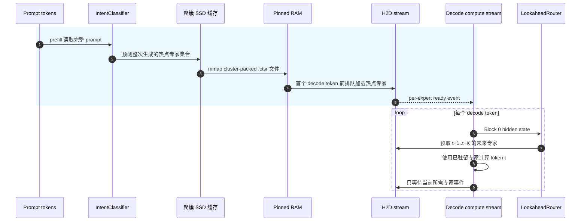
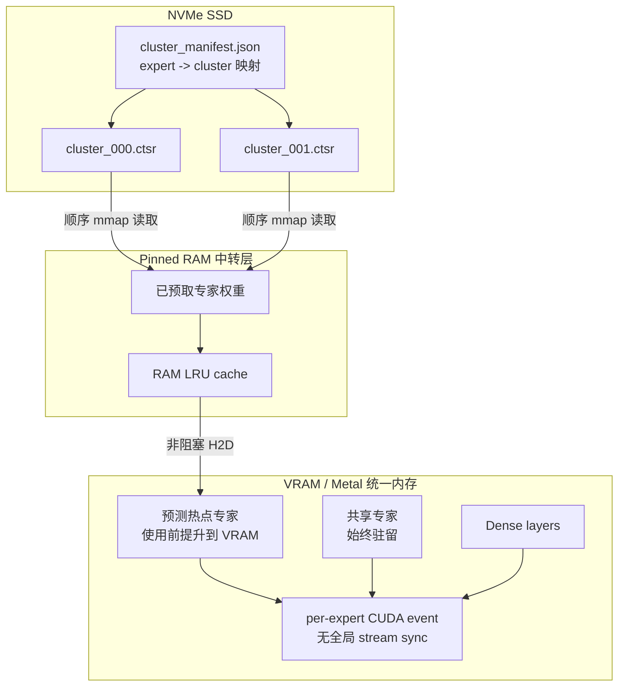
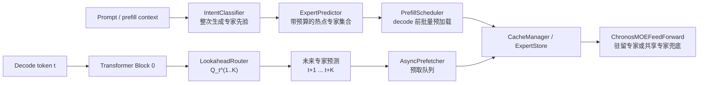
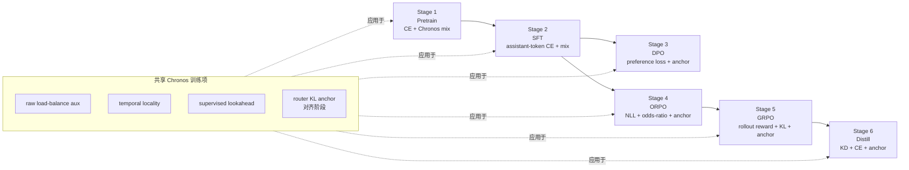
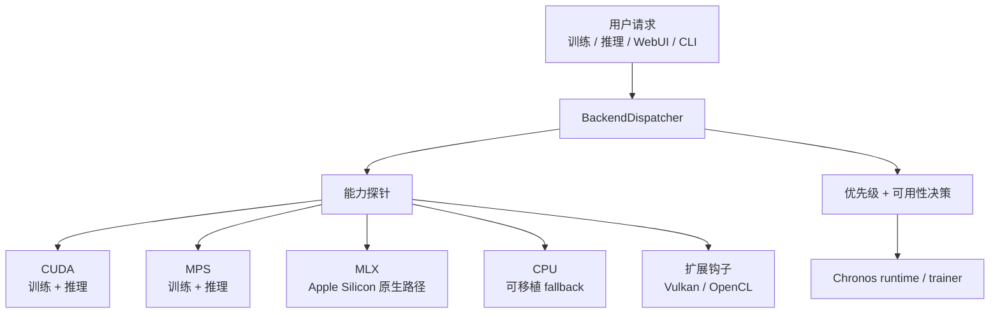
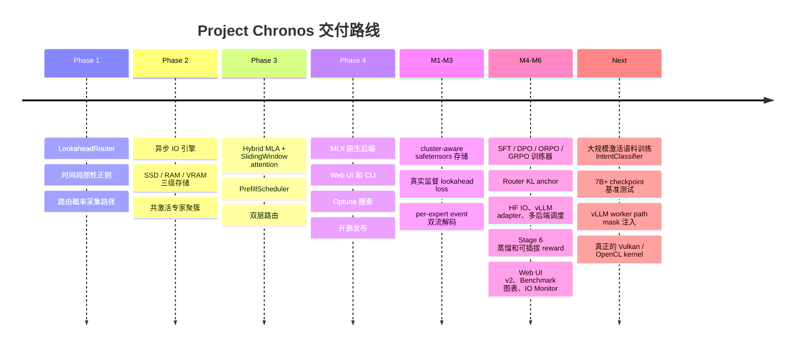
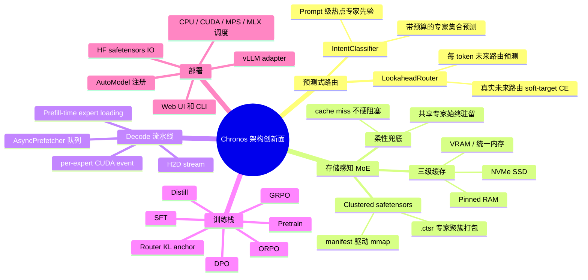

# Project Chronos (In Experimental)

**一套从架构层原生支持 SSD+DRAM 混合加载推理的 MoE 框架，配套完整的 6 阶段训练链路。**

[](https://pypi.org/project/Project_Chronos/)
[](LICENSE)
[](https://python.org)

[English](README.md)

---

## 现有方案的根本性缺陷

主流 MoE 模型（Mixtral、DeepSeek-MoE、Qwen-MoE 等）在消费级硬件上运行时，路由决策是**即时、被动、逐 token** 的——每一步 decode 才去检查所需专家是否在 VRAM 中。当 VRAM 不足时，系统在 decode 流中同步等待 SSD→RAM→VRAM 的搬运，生成速度跌至 **< 5 tokens/s**。

这不是参数调优问题，而是**架构层的根本缺陷**：这些模型设计时假设全量 VRAM 驻留，offload 是事后打的补丁。

---

## Chronos 的核心思路：把 IO 挪到 Prefill，把同步挪到事件级



两层关键改进：

1. **Prefill 时机**：`PrefillScheduler` + `IntentClassifier` 在第一个 decode token 之前批量预加载专家。
2. **事件级同步（M3）**：`promote_to_vram(blocking=False)` 在 `_h2d_stream` 上记录 `torch.cuda.Event`；compute 流通过 `current_stream.wait_event(evt)` **只等所需专家**，不再全局 `stream.synchronize()`。在 30ms 模拟 SSD 延迟下，新路径比旧路径有 **35ms+/token** 的流水线富余空间。

---

## 三级存储架构（M1：cluster-aware safetensors）



`cluster_manifest.json` 与 `.ctsr` 文件由离线 Louvain 聚类生成；运行时一次 `safetensors.safe_open(...).mmap` 把整个簇拉进 RAM，把随机读改写成顺序读。

### 缓存未命中时的处理

即使最坏情况也不会卡顿——柔性降级（Soft Gating）：

```python
# 纯张量乘法，无 Python 分支，torch.compile 不会图断裂
output = avail[i] * expert_output + (1.0 - avail[i]) * shared_expert_output
```

共享专家常驻；在 exact lazy/offload 对比模式下，Chronos 只会同步物化当前被路由选中的缺失专家，并按 LRU 卸载低热度专家以守住 resident budget，不会静默全量加载所有专家。只有显式启用 fallback 模式时，质量才会按共享专家路径平滑降级。

---

## 双层路由 + 监督的 Lookahead（M2）



| | IntentClassifier（第一层） | LookaheadRouter（第二层） |
|---|---|---|
| **触发时机** | Prefill 阶段一次 | Decode 每个 token |
| **输入** | 完整 Prompt（最多 512 token） | Block 0 的 hidden state |
| **输出** | 整次生成的专家集合 | t+1、t+2 步的专家 ID |
| **训练目标** | 真实激活日志监督（Phase 5） | **L_lookahead — 真实路由 t+k 作为 stop-grad teacher（M2）** |
| **参数量** | ~10–15M（单独训练） | ~2M（随主模型训练） |

M2 之前 LookaheadRouter 没有任何监督——只是个未训练的 head。M2 引入：

```math
L_{\mathrm{lookahead}}
= \frac{1}{|K_{\mathrm{valid}}|}
\sum_{k \in K_{\mathrm{valid}}}
\mathbb{E}_{b,t}
\left[
  - \sum_{e=1}^{E}
  \mathrm{sg}(P_{b,t+k,e}) \log Q_{b,t,e}^{(k)}
\right]
```

让前瞻头真正学习预测未来 K 步的路由分布。

---

## 完整训练链路（Stage 1 → Stage 6）

每个阶段都是独立的 entry script，**全部继承 Chronos 损失混合器**（lookahead + temporal + balance），并在对齐阶段引入**路由 KL 锚定**防止缓存命中率被 RL/DPO 梯度毁掉。



| Stage | 脚本 | 核心损失 | Router KL 锚定 (默认 λ) |
|---|---|---|---|
| 1 Pretrain  | `train_chronos.py`         | CE + balance + temporal + lookahead | 0.0 (off) |
| 2 SFT       | `train_chronos_sft.py`     | + 上述 mix                          | 0.01 (weak) |
| 3 DPO       | `train_chronos_dpo.py`     | DPO log-σ(β·logits) + mix          | 0.10 (strong) |
| 4 ORPO      | `train_chronos_orpo.py`    | NLL + λ·OR（无 ref model）          | 0.10 |
| 5 GRPO      | `train_chronos_grpo.py`    | PG·A − β·KL（含 ToyReward / 可插 LMRewardModel）| 0.10 |
| 6 Distill   | `train_chronos_distill.py` | α·T²·KL(s‖t) + (1−α)·CE             | 0.05 |

训练精度与资源策略：

- 默认 `--dtype auto`。MPS/MLX 训练优先解析为 BF16 以保证稳定性，CUDA/XPU 解析为 FP16；CPU 默认 FP32，只有显式传 `--dtype float16` 或 `--dtype bfloat16` 才启用 CPU autocast。
- CPU 训练默认使用物理核心；可用 `--cpu_threads` 或 `--cpu_budget_percent` 覆盖。
- macOS 上 MPS/MLX 训练默认强制 DataLoader workers 为 `0`，避免 multiprocessing 触发 Metal command-buffer 崩溃。CPU/CUDA 仍可使用 worker 进程；高级用户可用 `CHRONOS_ALLOW_METAL_DATALOADER_WORKERS=1` 覆盖这个保护。
- MLX 原生训练会按 `log_interval` 同步 UI 日志、标量读数和图表点；Web UI Stop 会在每个 batch 边界检查并停止。
- Web UI 每阶段保存后会写出 warning-only 的 `<checkpoint>.verify.json`，检查 no-mask vs all-available MoE 等价性，并在 Apple Silicon 上对比 MLX prefill logits 与 PyTorch CPU baseline。

MLX 训练是 Apple Silicon 原生后端，不是 `torch.to("mlx")`。六阶段 MLX
trainer 在 `chronos.mlx.*` 中复刻 PyTorch 训练栈：masked CE、DPO/ORPO/GRPO/
蒸馏损失、load balance、temporal locality、lookahead soft-target 监督、
lookahead top-k 命中损失、router KL anchor。即使权重使用 BF16/FP16，路由
softmax、CE、Adam moments 等数值敏感路径仍以 FP32 计算；因此 `auto` 在
MLX/MPS 上默认优先 BF16。FP16 的指数范围太小，在小模型/小 batch/路由分布
剧烈波动时更容易把 loss 推成 NaN。

Web UI 的 MLX 训练日志与 CPU/MPS 对齐：step、loss、steps/s、ETA、
checkpoint 保存事件、stop 事件、verify 结果都会同步到界面。Stop 在 batch
边界协作式生效；定期保存会写出可继续训练的 `.pth` 与同名 `.config.json`，
因此 MLX 阶段可以继续接 PyTorch、Export、Diagnose 链路。

完整 6 阶段端到端对比见 `tools/compare_minimind_chronos_v3.py`。

---

## 多后端调度（M5）



```python
from chronos.backend import BackendDispatcher
d = BackendDispatcher()
d.available()      # ['mlx', 'mps', 'cpu'] on Apple Silicon
                   # ['cuda', 'cpu']        on NVIDIA host
d.select()         # 自动选最佳；可被 CHRONOS_BACKEND 环境变量覆盖
d.describe()       # 人类可读的能力总览
```

- **一等公民（训练 + 推理）**：`cpu`、`mps`、`cuda`、`mlx`
- **推理仅 / 实验性**：`vulkan`（仅当 PyTorch `USE_VULKAN=ON` 自定义构建时存在）
- **第三方插件钩子**：`opencl`（替换 `chronos/backend/ext/opencl.py:PROBE()`）
- **Apple Silicon 策略**：推理 auto 仍优先 MLX；训练会走原生 `chronos.mlx.*` 路径，不会把 PyTorch 模型错误地 `.to("mlx")`。

诚实声明：上游 PyTorch 没有 OpenCL 后端、Vulkan 也仅在自定义构建中可用。Chronos 提供 dispatcher 接缝，使第三方插件无需改核心代码即可接入。

### MLX lazy/offload 运行时

MLX 使用 Apple 统一内存，因此 Chronos 在 MLX 上的 “VRAM/RAM” 是逻辑分层，
不是 PCIe 式物理分层。但 lazy runtime 仍严格遵守与 CUDA/MPS/CPU 一致的
offload contract：

- **Hot slots**：只保存执行预算内、已经 materialize 成 MLX live module 的专家。
- **Warm cache**：只保存有界预测缓冲，从 `.ctsr` safetensors 中按专家/簇加载；
  不允许暗中保留全量专家副本。
- **Cold storage**：checkpoint/export reader 或 per-expert cluster cache。Lazy
  模式创建 cache 后会把 live experts 替换为 placeholder；不会保留 `_saved_live`
  这种全量专家修复缓存。
- Lookahead 预测只进入 warm cache 队列，只有 ready 的专家才会 promote。真实 miss
  只同步 materialize 当前被选中的专家，不会 full-load 整个模型。
- MLX attention 会按需扩容 RoPE lookup table，因此 prompt 长度加 decode 超过
  `max_position_embeddings` 时不会在第 257/513 等 token 崩溃。

Inference compare/sweep 会报告真实 hot/warm 数量、resident hit、prediction hit、
sync SSD loads、MLX active/cache/peak memory、进程 RSS、prefill/decode 时间与
tokens/s。只有确定性 exact-lazy 输出与 full-DRAM 一致、且 fallback weight 为 0，
才应该把该 checkpoint 标记为 offload-ready。

---

## HuggingFace / vLLM 兼容（M5）

- `ChronosForCausalLM` 继承 `PreTrainedModel`，已注册 `AutoConfig` / `AutoModelForCausalLM`，无需 `trust_remote_code`：

  ```python
  from transformers import AutoModelForCausalLM
  model = AutoModelForCausalLM.from_pretrained("./out_dir")
  ```

- `chronos.model.hf_io.save_chronos_pretrained` / `load_chronos_pretrained` 输出标准 `model.safetensors` + `config.json`，并把 `cluster_manifest.json` + `.ctsr` 一起带过去；roundtrip logits 0.00e+00 偏差。

- `chronos.serving.register_chronos_with_vllm()` 在已安装 vLLM 时把 Chronos 注册到 `ModelRegistry`；未安装时打印安装提示，**不报错**。worker 侧 mask 注入 hook 见 `docs/vllm_integration.md`。

---

## 与现有方案对比

| 特性 | llama.cpp offload | vLLM offload | **Project Chronos** |
|---|---|---|---|
| 专家预测 | 无（被动） | 无（被动） | **主动预测（IntentCLF + LookaheadRouter）** |
| Lookahead 训练 | n/a | n/a | **L_lookahead 真实监督（M2）** |
| IO 时机 | Decode 期间（阻塞） | Decode 期间（阻塞） | **Prefill 期间（异步，前置）** |
| Decode 流水线 | 同步 | 同步 | **双流 + per-expert event（M3）** |
| Cache miss 行为 | 硬阻塞 | 硬阻塞 | **Soft Gating（零阻塞）** |
| 磁盘格式 | gguf | safetensors | **cluster-packed safetensors（.ctsr）** |
| 训练集成 | 事后补丁 | 事后补丁 | **6 阶段全栈 + 路由 KL 锚定** |
| 后端调度 | 编译期固定 | CUDA-only | **cpu / mps / cuda / mlx 自动 + vulkan/opencl 钩子** |
| Apple Silicon 原生 | 部分 | 无 | **完整 MLX 后端** |
| HuggingFace 兼容 | 仅 GGUF | ✓ | ✓ + 携带专家缓存 |
| vLLM 兼容 | n/a | 原生 | **可选 adapter（按需注册）** |

---

## 损失函数（完整形式）

```math
L_{\mathrm{total}} =
L_{\mathrm{base}}
+ \lambda_{\mathrm{bal}} L_{\mathrm{aux}}
+ \lambda_{\mathrm{tmp}} L_{\mathrm{temporal}}
+ \lambda_{\mathrm{LA}} L_{\mathrm{lookahead}}
+ \lambda_{\mathrm{anc}} L_{\mathrm{routerKL}}
```

```math
L_{\mathrm{aux}} = E \sum_{e=1}^{E} load_e \cdot \overline{p}_e
```

```math
L_{\mathrm{temporal}} =
\mathbb{E}_{b,t}
\left[
  \left\| P_{b,t,:} - P_{b,t-1,:} \right\|_2^2
\right]
```

```math
L_{\mathrm{routerKL}} =
D_{\mathrm{KL}}
\left(
  \pi_{\theta}^{\mathrm{router}}
  \|
  \pi_{\mathrm{ref}}^{\mathrm{router}}
\right)
```

- `L_base`：阶段相关目标（CE / DPO / ORPO / GRPO / KD）。
- `L_aux`：未缩放的 MoE load-balance 辅助项；Chronos 在 `chronos_loss_term` 中只乘一次 `lambda_bal`。
- `L_temporal`：约束相邻 token 的路由分布不要剧烈跳变，提高专家复用和缓存局部性。
- `L_lookahead`：未来真实路由分布到前瞻预测的 soft-target cross entropy。`sg(...)` 表示 stop-gradient。
- `L_routerKL`：对齐阶段锚定 stage 开始时捕获的参考路由分布，防止 RL/DPO/ORPO/GRPO 梯度破坏聚簇布局。

`λ` 全部支持 Optuna TPE 自动搜索（包括 `hidden_size` / `num_experts` / `kv_latent_dim` 等结构超参）。

---

## 安装  (Not Ready in PyPI Yet)

```bash
pip install Project_Chronos
```

或从源码：

```bash
git clone https://github.com/FonaTech/Project_Chronos
cd Project_Chronos
pip install -e ".[dev]"
```

**MLX（Apple Silicon）：**
```bash
pip install "Project_Chronos[mlx]"
```

**vLLM 服务（可选，仅 Linux+CUDA）：**
```bash
pip install vllm
```

> **minimind 依赖**：Project Chronos 使用 [minimind](https://github.com/jingyaogong/minimind) 作为 MoE 内核。
> 若本地未找到，首次 import 时自动克隆至 `~/.cache/chronos/minimind-master/`。
> minimind 采用 **Apache-2.0** 授权，完整归属见 [THIRD_PARTY_NOTICES.md](THIRD_PARTY_NOTICES.md)。

**环境要求**：Python 3.10+，PyTorch 2.4+

---

## 快速开始

### Web UI（M6 — 8 个 Tab，4 种语言）

```bash
chronos-ui
# 或
python chronos_app.py
```

包含：⚙️ Config（含右侧实时参数估算面板，合并了 Designer）/ 🏋️ Train（拥有 data_path）/ 🧪 6-Stage Pipeline（每阶段独立数据路径）/ 💬 Inference（含懒加载 vs 全量 DRAM 对比）/ 📦 Export（FP16/Q8_0 safetensors 与 GGUF）/ 📊 Benchmark（Markdown 表 + 对比图）/ 🔬 Auto-Tune（持久化日志 + 一键 Apply Best → Config）/ 📡 IO Monitor。i18n 支持 zh-Hans / zh-Hant / en / ja。

### 部署导出

```bash
chronos export \
    --model_path ./out/sft_384_moe.pth \
    --output_dir ./exports/sft_384 \
    --formats fp16-safetensors q8_0-safetensors fp16-gguf q8_0-gguf
```

导出产物包含 `config.json`、`chronos_export_manifest.json`，并写入 MoE
top-k、共享 fallback expert、lookahead router、混合注意力、可选专家缓存布局等
Chronos 元数据。Chronos 原生 loader 可以从导出的 `safetensors` / `GGUF`
产物直接走懒加载专家链路。

兼容性说明：GGUF 使用 `general.architecture=chronos`。未实现 Chronos
architecture 的 stock Ollama/llama.cpp 不能正确执行该模型；Chronos 不是
LLaMA tensor layout 的简单改名。

### Stage 1：预训练

```bash
python train_chronos.py \
    --data_path ./tests/fixtures/tiny_pretrain.jsonl \
    --hidden_size 256 --num_hidden_layers 4 --num_experts 4 \
    --epochs 1 --device cpu --save_dir ./out
```

### Stage 2-5：对齐链路

```bash
python train_chronos_sft.py   --data_path ./tests/fixtures/tiny_sft.jsonl   --from_weight chronos --save_dir ./out --device cpu
python train_chronos_dpo.py   --data_path ./tests/fixtures/tiny_dpo.jsonl   --from_weight sft     --save_dir ./out --device cpu
python train_chronos_orpo.py  --data_path ./tests/fixtures/tiny_dpo.jsonl   --from_weight sft     --save_dir ./out --device cpu
python train_chronos_grpo.py  --data_path ./tests/fixtures/tiny_grpo.jsonl  --from_weight orpo    --save_dir ./out --device cpu \
    --reward toy   # 或 lm:/path/to/reward-model
```

### Stage 6：蒸馏

```bash
python train_chronos_distill.py \
    --data_path ./tests/fixtures/tiny_sft.jsonl \
    --teacher_path ./out/sft_192_moe.pth \
    --from_weight grpo --save_dir ./out --device cpu \
    --alpha 0.7 --temperature 4.0
```

### Checkpoint 与 offload 诊断

新的 `.pth` checkpoint 会同步写出同名 `*.config.json`，保存无法从权重形状反推的 MoE 拓扑字段，例如 `num_experts_per_tok`。诊断命令会检查 chat template 生成、`no_mask` vs `all_available` masked drift、全冷 shared fallback、LookaheadRouter 预测质量，以及 SSD/RAM/VRAM offload 统计。

```bash
python diagnose_checkpoint.py \
    --model_path ./out/sft_384_moe.pth \
    --config_path ./chronos_config.json \
    --sft_data ../Dataset/sft_t2t.jsonl \
    --mlx_parity \
    --device cpu

# 或使用统一 CLI：
chronos diagnose --model_path ./out/sft_384_moe.pth --config_path ./chronos_config.json
```

后端速度与 dtype sanity check：

```bash
python benchmark_training_backends.py --backends cpu mps mlx --dtypes auto bfloat16 float16 --steps 2
```

### 端到端对比（minimind vs Chronos）

```bash
python tools/compare_minimind_chronos_v3.py \
    --pretrain_steps 150 --align_steps 30 --distill_steps 30 \
    --simulated_ssd_ms 30 --device cpu \
    --output results/compare_results_v3.json
```

输出包括：每阶段 loss、HF roundtrip Δlogit、tokens/sec、激活专家比例、常驻专家字节、M3 流水线富余空间、当前主机后端列表。

### 专家聚簇存储（最大化 SSD 顺序读）

```python
from chronos.io.cluster_layout import (
    collect_activation_log, build_cooccurrence_matrix,
    try_louvain_clustering, repack_expert_weights_safetensors,
)
log = collect_activation_log(model, calib_loader, "cpu", max_batches=50)
clusters = try_louvain_clustering(build_cooccurrence_matrix(log, num_experts))
repack_expert_weights_safetensors(model, clusters, "./expert_cache_clustered")
```

### λ + 结构超参自动搜索

```python
from chronos.tuning.chronos_auto_tuner import ChronosAutoTuner, ChronosSearchSpaceConfig

tuner = ChronosAutoTuner()
tuner.start(
    model_id="./out/chronos_256_moe.pth",
    dataset_path="./dataset/train.jsonl",
    search_space=ChronosSearchSpaceConfig(
        tune_lambda_balance=True, tune_lambda_temporal=True,
        tune_lambda_lookahead=True, tune_lookahead_steps=True,
        tune_hidden_size=True, tune_num_experts=True,
        tune_num_shared_experts=True, tune_kv_latent_dim=True,
    ),
    n_trials=20,
)
```

---

## 项目结构

```
Project_Chronos/
├── chronos/
│   ├── deps.py                    # 自动下载 minimind（若本地未找到）
│   ├── __init__.py                # 注册 AutoConfig / AutoModelForCausalLM
│   ├── model/
│   │   ├── config.py              # ChronosConfig（lookahead/temporal/anchor/storage_format 等）
│   │   ├── hybrid_attention.py    # MLAAttention + SlidingWindowAttention
│   │   ├── lookahead_router.py    # 逐 token 前瞻预测器（第二层）
│   │   ├── moe_chronos.py         # ChronosMOEFeedForward + 共享专家 + Soft Gating
│   │   ├── model_chronos.py       # ChronosForCausalLM（_tied_weights_keys 已修补）
│   │   ├── temporal_loss.py       # 时间局部性 + lookahead 监督损失
│   │   └── hf_io.py               # save/load_chronos_pretrained + AutoModel 注册
│   ├── io/
│   │   ├── expert_store.py        # 三级存储 + per-expert Event + 非阻塞 promote
│   │   ├── async_prefetcher.py    # 异步预取（prefetch_only / promote_current 已分离）
│   │   ├── storage.py             # ClusterStorage：.ctsr safetensors + manifest
│   │   ├── cluster_layout.py      # 共现聚簇 + safetensors 重排
│   │   └── io_simulator.py        # CHRONOS_SIM_SSD_MS 测试钩子（M3）
│   ├── router/
│   │   ├── intent_classifier.py   # Prompt 级专家预测器（第一层，~10M 参数）
│   │   ├── expert_predictor.py    # IntentVector → ExpertSet（含预算上限）
│   │   └── prefill_scheduler.py   # 编排 prefill 阶段批量预加载
│   ├── mlx/                       # Apple Silicon 原生后端
│   │   ├── attention.py / moe.py / model.py / expert_store.py / inference.py
│   ├── runtime/
│   │   ├── cache_manager.py       # prefetch_for_next_step / ensure_resident（M3）
│   │   ├── inference_engine.py    # 端到端推理引擎（重排为 H2D-compute 重叠）
│   │   └── metrics.py             # MetricsBus（IO Monitor 数据源）
│   ├── trainer/
│   │   ├── loss_mixin.py          # chronos_loss_term + router_kl_anchor + capture_reference_routing
│   │   ├── chronos_trainer.py     # Pretrain
│   │   ├── sft_trainer.py         # Stage 2
│   │   ├── dpo_trainer.py         # Stage 3
│   │   ├── orpo_trainer.py        # Stage 4（无 ref model）
│   │   ├── grpo_trainer.py        # Stage 5（含 self-contained rollout）
│   │   ├── distill_trainer.py     # Stage 6（KL/T² + α 混合）
│   │   └── reward.py              # ToyReward / LMRewardModel / build_reward_fn
│   ├── tuning/
│   │   └── chronos_auto_tuner.py  # Optuna λ + 结构超参搜索
│   ├── eval/
│   │   ├── io_profiler.py         # Phase 1 验证（前瞻准确率）
│   │   └── benchmark.py           # 端到端基准测试
│   ├── data/
│   │   └── flexible_dataset.py    # 自动识别任意 JSONL 字段格式
│   ├── backend/
│   │   ├── __init__.py            # BackendDispatcher（cpu/mps/cuda/mlx）
│   │   ├── dispatcher.py          # 探针 + 优先级 + 训练能力声明
│   │   └── ext/opencl.py          # 第三方 OpenCL 插件钩子（stub）
│   ├── _backend_legacy.py         # 向后兼容 build_model() 等旧 API
│   ├── serving/
│   │   ├── __init__.py
│   │   └── vllm_adapter.py        # 可选 vLLM 注册（无 vLLM 时优雅降级）
│   └── cli.py                     # 统一 CLI
├── ui/                            # Gradio Web UI（i18n: zh-Hans/zh-Hant/en/ja）
│   ├── i18n.py
│   ├── estimator.py               # 实时参数量/内存估算（与 Config 同步）
│   └── tabs/
│       ├── config_tab.py          # 已合并 Designer，右侧实时估算面板
│       ├── train_tab.py           # 拥有 data_path（不再属于 Config）
│       ├── pipeline_tab.py        # 6 阶段，每段独立 data_path
│       ├── inference_tab.py
│       ├── benchmark_tab.py       # Markdown 表 + gr.BarPlot
│       ├── autotune_tab.py        # 持久化日志 + Apply Best → Config
│       └── iomon_tab.py           # MetricsBus 实时仪表盘
├── chronos_app.py                 # Web UI 入口
├── train_chronos.py               # Stage 1 入口
├── train_chronos_sft.py           # Stage 2 入口
├── train_chronos_dpo.py           # Stage 3 入口
├── train_chronos_orpo.py          # Stage 4 入口
├── train_chronos_grpo.py          # Stage 5 入口
├── train_chronos_distill.py       # Stage 6 入口
├── tools/
│   ├── compare_minimind_chronos.py      # v1 (M1+M2)
│   ├── compare_minimind_chronos_v2.py   # v2 (M3+M4)
│   └── compare_minimind_chronos_v3.py   # v3 (含 6 阶段 + HF roundtrip + 后端报告)
├── tests/
│   ├── test_smoke.py              # 18 个单元测试
│   ├── test_smoke_cuda.py         # 仅 CUDA 主机执行
│   └── fixtures/                  # tiny_pretrain / tiny_sft / tiny_dpo / tiny_grpo
├── docs/
│   └── vllm_integration.md
├── pyproject.toml
└── README.md / README_zh.md / THIRD_PARTY_NOTICES.md
```

---

## 开发路线图





---

## 引用

```bibtex
@misc{chronos2026,
  title  = {Project Chronos: Prefill-Time Expert Loading and Dual-Layer Routing
             for Zero-Stall On-Device MoE Inference},
  author = {Fona and Project Chronos Contributors},
  year   = {2026},
  url    = {https://github.com/FonaTech/Project_Chronos}
}
```

---

## 第三方归属

Project Chronos 基于 **jingyaogong** 的 [minimind](https://github.com/jingyaogong/minimind)（Apache-2.0）构建。完整归属见 [THIRD_PARTY_NOTICES.md](THIRD_PARTY_NOTICES.md)。

---

## License

Apache 2.0 — see [LICENSE](LICENSE)
